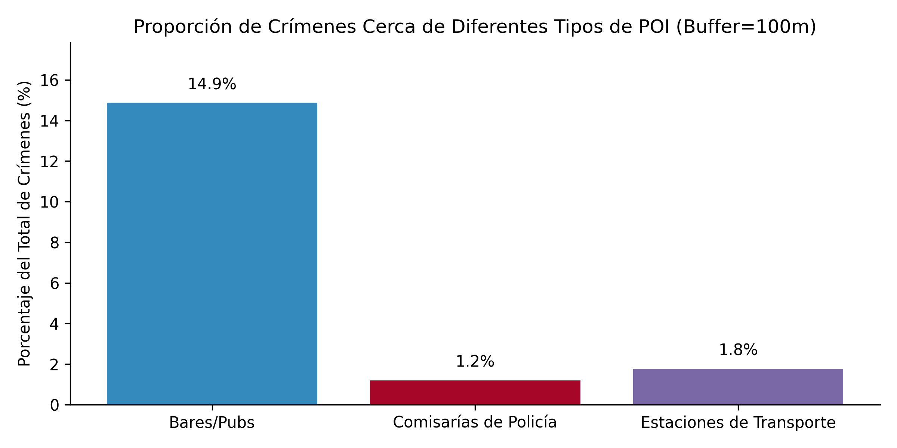
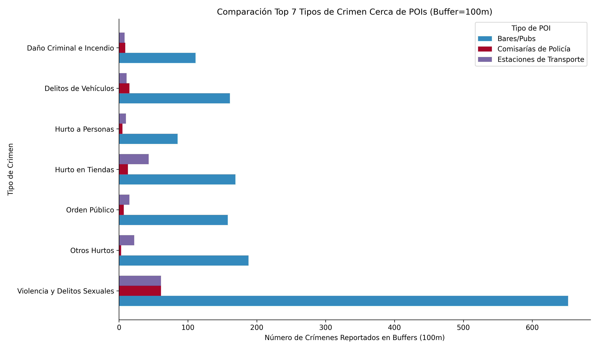

# Análisis Espacial de Hotspots de Crimen en Birmingham (2023): Coropletas LSOA, Densidad Kernel y Proximidad a POI

**Autor:** Jhonfred Galarraga
**Fecha:** Abril 2025

## Descripción del Proyecto

Este proyecto realiza un análisis multifacético de los datos de crímenes reportados ocurridos dentro de la ciudad de Birmingham (UK) durante el año 2023. El objetivo es identificar, visualizar y comparar patrones de concentración espacial de incidentes delictivos (hotspots) utilizando diversas técnicas de análisis geoespacial, proporcionando una comprensión detallada de la geografía del crimen en la ciudad.

## Análisis Realizados

*   **Agregación por LSOA:** Cálculo del número total de crímenes por Lower Layer Super Output Area (LSOA).
*   **Visualización Coropletas (Total):** Mapa de coropletas mostrando la distribución del crimen total por LSOA, utilizando clasificación **Natural Breaks (Jenks)** para manejar datos sesgados.
*   **Análisis Coropletas por Tipo de Crimen:** Generación de mapas comparativos (lado a lado) para tipos de crimen específicos ('Delitos Violentos y Sexuales', 'Delitos de Vehículos', 'Robo en Edificaciones') para identificar patrones espaciales diferenciados.
*   **Estimación de Densidad Kernel (KDE):** Creación de un mapa de calor continuo utilizando QGIS para visualizar la densidad de puntos de crimen, independiente de los límites administrativos.
*   **Análisis de Proximidad a POI:** Cuantificación de la concentración de crímenes dentro de un buffer de 100 metros alrededor de Puntos de Interés clave (Bares/Pubs, Comisarías de Policía, Estaciones de Transporte) descargados desde OpenStreetMap vía `osmnx`.

## Visualizaciones Clave

**Mapa de Densidad Kernel (KDE) - Resultado Principal:**
*(Muestra dónde se aglomeran los puntos de crimen)*

**Comparación de Hotspots por Tipo de Crimen (Coropletas LSOA):**
*(Muestra cómo varían los patrones según el tipo de delito)*

**Resultados del Análisis de Proximidad a POI:**
*(Resumen cuantitativo de la influencia de POIs)*

## Tecnologías Utilizadas

*   **Python**
*   **Pandas:** Manipulación de datos tabulares.
*   **GeoPandas:** Manipulación y análisis de datos geoespaciales vectoriales.
*   **Matplotlib:** Generación de gráficos estáticos.
*   **Mapclassify:** Aplicación de esquemas de clasificación para coropletas.
*   **OSMnx:** Descarga de datos de Puntos de Interés (POI) desde OpenStreetMap.
*   **NumPy:** Computación numérica.
*   **QGIS (v3.40.3):** Generación y estilización del mapa KDE, creación de composición cartográfica final.
*   **Google Colab / Jupyter Notebook:** Entorno de desarrollo interactivo.
*   **GitHub:** Control de versiones y presentación del proyecto.

## Fuentes de Datos

1.  **Datos de Crímenes (2023):** Origen `data.police.uk` (West Midlands Police), descargados desde Kaggle como CSVs pre-divididos por fuerza. Se utilizó el archivo correspondiente a West Midlands Police.
2.  **Límites Geográficos LSOA de Birmingham (2021):** Origen ONS, descargados desde Birmingham City Observatory (`cityobservatory.birmingham.gov.uk`) como archivo GeoJSON específico para Birmingham.
3.  **Puntos de Interés (POI):** Descargados desde OpenStreetMap (OSM) vía `osmnx` (Tags: `amenity`=[bar, pub, police], `public_transport`=station).
4.  **Mapa Base (para KDE):** CartoDB Positron. Atribución: `© OpenStreetMap contributors, © CARTO`.

## Metodología Resumida

1.  **Carga y Limpieza:** Carga de datos LSOA (GeoJSON) y crímenes (CSV). Inspección inicial.
2.  **Preprocesamiento LSOA:** Filtrado de crímenes para pertenecer a LSOAs de Birmingham. Agregación del conteo total de crímenes por LSOA y unión al GeoDataFrame LSOA.
3.  **Visualización Coropletas:** Generación de mapa coropletas del crimen total usando clasificación Natural Breaks (k=7).
4.  **Análisis por Tipo:** Filtrado adicional por tipo de crimen ('Violencia/Sexual', 'Vehículos', 'Robo Edif.'), repetición de agregación/unión, y generación de mapas coropletas comparativos (Natural Breaks, k=5).
5.  **Preparación Datos KDE:** Creación de GeoDataFrame de puntos de crimen, reproyección a EPSG:27700 (British National Grid), exportación (GeoPackage).
6.  **Generación KDE en QGIS:** Uso de herramienta Mapa de Calor (R=250m, Px=10m), estilización (rampa RdYlBu invertida, transparencia), composición cartográfica profesional (incluyendo metadatos) y exportación PNG (300 ppp).
7.  **Preparación Datos POI:** Descarga desde OSM vía `osmnx`, limpieza, clasificación ('Bar/Pub', 'Police', 'Station'), reproyección a EPSG:27700.
8.  **Análisis de Proximidad:** Creación de buffers (100m), disolución, unión espacial con puntos de crimen, cálculo de porcentajes y desglose por tipo de crimen.
9.  **Visualización POI:** Generación de gráficos de barras comparativos para los resultados de proximidad.

## Hallazgos Clave

*   Existe una **fuerte concentración espacial** del crimen en Birmingham, especialmente en el **centro de la ciudad**.
*   Los **patrones espaciales varían significativamente según el tipo de crimen**:
    *   Delitos Violentos/Sexuales: Muy concentrados en el núcleo central.
    *   Delitos de Vehículos: Patrón mixto (centro + corredores/clusters secundarios).
    *   Robo en Edificaciones: Patrón disperso con múltiples focos locales.
*   El análisis **KDE confirma el hotspot central** y revela la estructura fina y continua de las áreas de alta densidad, mostrando cómo cruzan los límites LSOA.
*   Se encontró una **correlación espacial significativa** entre la proximidad (<100m) a **Bares/Pubs y la incidencia delictiva (~15% del total)**, especialmente para Delitos Violentos/Sexuales. Esta correlación es mucho menor para Comisarías (1.2%) y Estaciones de Transporte (1.8%).

## Estructura del Repositorio

*   `README.md`: Esta documentación.
*   `Analisis_Espacial_Crimen_BHAM_2023_Coropletas_Kernel_POI.ipynb`: Notebook de Jupyter/Colab con todo el código Python, análisis y documentación detallada.
*   `requirements.txt`: Lista de dependencias de Python necesarias.
*   `images/`: Carpeta para guardar las imágenes exportadas (mapas, gráficos) usadas en el README y el notebook.
*   `data/` : Carpeta con los archivos de datos utilizados en el estudio.

## Configuración y Uso

1.  **Entorno:** Se recomienda usar Google Colab o un entorno local con las librerías listadas en `requirements.txt` instaladas.
2.  **Datos:**
    *   Descargar los datos de crímenes de West Midlands Police (2023) desde Kaggle/data.police.uk.
    *   Descargar el archivo GeoJSON de LSOAs de Birmingham desde Birmingham City Observatory.
    *   Los datos POI se descargan directamente desde OSM usando `osmnx` en el notebook.
    *   Colocar los archivos descargados en la ubicación esperada (ej. carpeta definida por `base_path` si se usa Google Drive) o ajustar las rutas en el notebook.
3.  **Librerías Python:** Instalar las dependencias: `pip install -r requirements.txt`.
4.  **Ejecutar el Notebook:** Abrir el archivo `.ipynb` en Colab/Jupyter y ejecutar las celdas secuencialmente.
5.  **Paso de QGIS (KDE):** El notebook genera y exporta los datos de puntos necesarios (`birmingham_crime_points_proj.gpkg`). Este archivo debe cargarse en QGIS para realizar el análisis KDE y la composición cartográfica como se describe en la Sección 8. La imagen resultante debe guardarse e idealmente colocarse en la carpeta `images/`.

## Trabajo Futuro

*   Analizar proximidad a otros tipos de POI (parques, escuelas).
*   Incorporar datos socioeconómicos LSOA (ej. calcular tasas de crimen).
*   Análisis temporal más detallado (estacionalidad, día/hora).
*   Modelado predictivo de riesgo espacial.
*   Crear visualizaciones interactivas (`folium`).

---
